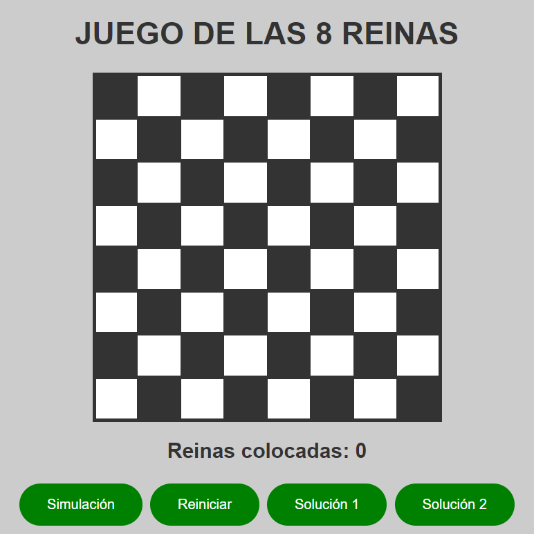

# JUEGO DE LAS 8 REINAS
> Este repositorio contiene un juego interactivo de las 8 reinas, un problema clásico de ciencias de la computación. 
El objetivo es colocar 8 reinas en un tablero de ajedrez de manera que ninguna reina pueda atacar a otra, 
es decir, ninguna reina puede estar en la misma fila, columna o diagonal que otra reina.

## Requisitos
> Para ejecutar el juego, necesitarás un navegador web compatible con JavaScript y HTML5.

## Instrucciones
1. Descarga o clona este repositorio en tu equipo.
2. Abre el archivo index.html en tu navegador web.
3. Coloca las reinas en el tablero de ajedrez haciendo clic en las casillas.
4. Una vez que hayas colocado 8 reinas, haz clic en el botón "Simulación".
5. Si el juego se completó correctamente, aparecerá un mensaje indicándolo. De lo contrario, se indicará en qué posiciones están las reinas que se atacan entre sí.

### Este sitio fue construido usando [GitHub Pages](https://jorgegaman.github.io/8REINAS.github.io/)

